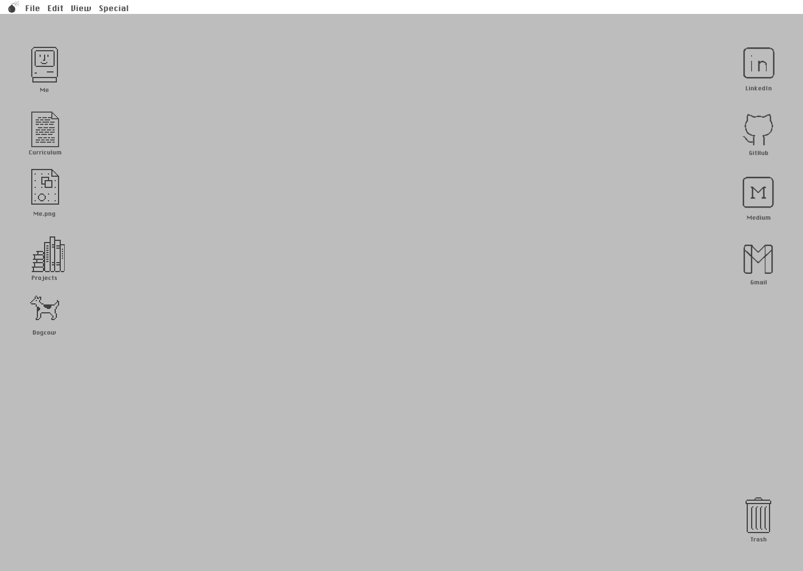

# StevenOS - Meu portfolio

## 🎨 Design do projeto no Figma
[Figma](https://www.figma.com/file/bkx6xDN5G1Vg9nV9HyaXJu/Untitled?type=design&node-id=30%3A30&mode=design&t=Fjr9DYPAt1gOX5iJ-1)

## 🚀 Projeto em produção
[StevenOS](https://steven-os.vercel.app/)
